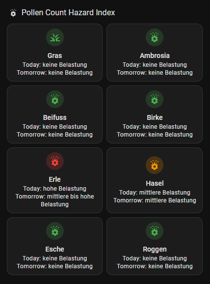

# Home Assistant Pollen Dispersal Integration

This repository provides a YAML configuration for integrating Deutscher Wetterdienst (DWD) pollen dispersal data into Home Assistant. It utilizes the DWD Pollenflug integration and Mushroom Cards for an enhanced user interface.

## Prerequisites

Before setting up this integration, ensure you have the following installed:

Home Assistant Community Store (HACS): A powerful integration manager for Home Assistant.
- Installation Guide: HACS Installation

Mushroom Cards: A collection of customizable cards to beautify your Home Assistant dashboard.
- Installation via HACS:
* Navigate to HACS in your Home Assistant instance.
* Go to the "Frontend" section.
* Search for "Mushroom" and install the integration.
* After installation, refresh your browser to apply changes.
- Official Repository: [Mushroom Cards GitHub](https://github.com/piitaya/lovelace-mushroom)

# Installation Steps

Install DWD Pollenflug Integration:
- This integration fetches pollen forecasts from DWD for various regions in Germany.
- Installation via HACS:
* Open HACS in Home Assistant.
* Navigate to the "Integrations" section.
* Search for "DWD Pollenflug" and install the integration.
* Restart Home Assistant to apply changes.
- Official Repository: [DWD Pollenflug GitHub](https://github.com/mampfes/hacs_dwd_pollenflug)

# Configure the Integration:

After installation, configure the integration by adding the provided YAML configuration to your configuration.yaml file. Ensure you specify your region and desired allergens.

There is a file named `pollen_count.yml` in the root of the repository. Follow the instructions below to integrate DWD Pollenflug into your Home Assistant dashboard and configure it using YAML.

**Add to Dashboard:**
  - Navigate to your Home Assistant dashboard.
  - Enter the edit mode by clicking the three dots in the top right corner and selecting "Edit Dashboard".
  - Add a new card by clicking the "+" button.
  - Choose the "Manual" card option.
  - Copy and paste the YAML configuration into the card editor.

**Save and Refresh:**
  - Save the changes and exit the edit mode.
  - Refresh your browser to see the updated dashboard with the DWD Pollenflug integration.

By following these steps, you will have successfully integrated DWD Pollenflug into your Home Assistant dashboard and configured it using YAML.

# Contributions

Contributions to enhance this integration are welcome. Please fork the repository and submit a pull request with your improvements.

# License

This project is licensed under the terms specified in the [LICENSE](LICENSE) file.